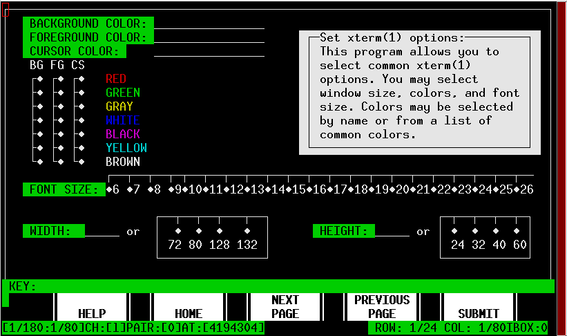
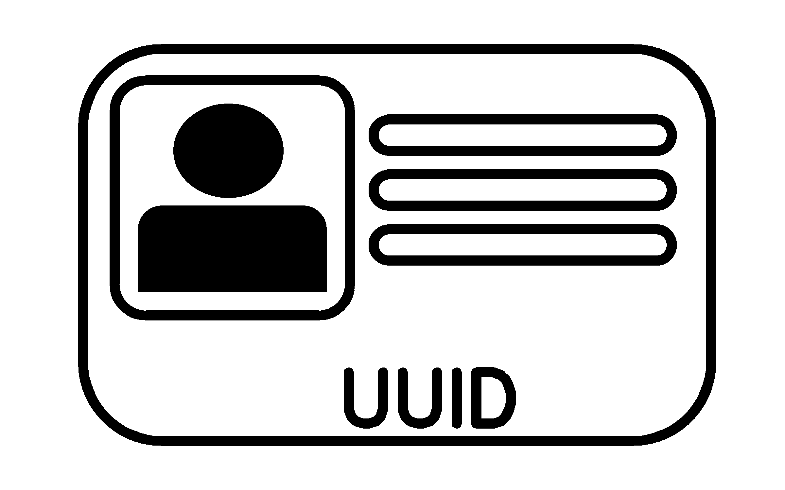

# Work-In-Progress
   
   **M_fixedform** simplifies creating a TUI (Terminal User Interface)
   with Ncurses from Fortran. That is it facilitates creating simple
   forms in terminal windows.

## 

   The idea of **M_fixedform** is based on fuzzy memories of the
   CDC NOS TDU Fortran interface and PDU and CCL where a simple text
   representation of a form plus some simple descriptions could be turned
   into a screen-mode interface from Fortran.

   Surprisingly, long after creating this I found a manual for the
   TDU product from long ago that inspired this. Although they are not
   all that similiar after all, M_fixedform and PDUs at least share an
   approach where a simple text template defines a more refined TDI:

   [NOS TDU manual](http://www.bitsavers.org/pdf/cdc/Tom_Hunter_Scans/NOS_2_Screen_Formatting_RefMan_Apr88.pdf)

   Still in beta so subject to change, but this has been stable for
   a long time. Probably at least needs scrolling input fields and
   pull-down menus.

   A sample view of a **M_fixedform** input file as it would be rendered on the
   screen that also describes the input file format converted to HTML (using an
   included program) is in 
   [paper0001](https://urbanjost.github.io/M_fixedform/paper0001.html) 

## 

## Name
   M_fixedform(3f) - use M_ncurses to generated fixed forms
   (LICENSE:MIT)
## Synopsis
```text
       use M_fixedform
```
## Description

---

---
## Building the Module using make(1)
     git clone https://github.com/urbanjost/M_fixedform.git
     cd M_fixedform/src
     # change Makefile if not using one of the listed compilers
     
     # for gfortran
     make clean
     make F90=gfortran gfortran
     
     # for ifort
     make clean
     make F90=ifort ifort

     # for nvfortran
     make clean
     make F90=nvfortran nvfortran

This will compile the Fortran module and basic example
program that exercise the routine.

---

---
## Build and Test with FPM

   Alternatively, download the github repository and build it with
   fpm ( as described at [Fortran Package Manager](https://github.com/fortran-lang/fpm) )

   ```bash
        git clone https://github.com/urbanjost/M_fixedform.git
        cd M_fixedform
        fpm run "*"
        fpm run --example "*"
        fpm test
   ```

   or just list it as a dependency in your fpm.toml project file.

```toml
        [dependencies]
        M_fixedform        = { git = "https://github.com/urbanjost/M_fixedform.git" }
```
---

---
## Documentation

### User
   - A single page that uses javascript to combine all the HTML
     descriptions of the man-pages is at 
     [BOOK_M_fixedform](https://urbanjost.github.io/M_fixedform/BOOK_M_fixedform.html).

   - a simple index to the man-pages in HTML form for the
   [routines](https://urbanjost.github.io/M_fixedform/man3.html) 
   and [programs](https://urbanjost.github.io/M_fixedform/man1.html) 

   - There are man-pages in the repository download in the docs/ directory
     that may be installed on ULS (Unix-Like Systems).

   - 
      + [manpages.zip](https://urbanjost.github.io/M_fixedform/manpages.zip)
      + [manpages.tgz](https://urbanjost.github.io/M_fixedform/manpages.tgz)

   - [CHANGELOG](docs/CHANGELOG.md) provides a history of significant changes

### Developer
   - [ford(1) output](https://urbanjost.github.io/M_fixedform/fpm-ford/index.html).
<!--
   - [doxygen(1) output](https://urbanjost.github.io/M_fixedform/doxygen_out/html/index.html).
-->
   - [github action status](docs/STATUS.md) 
---

---
